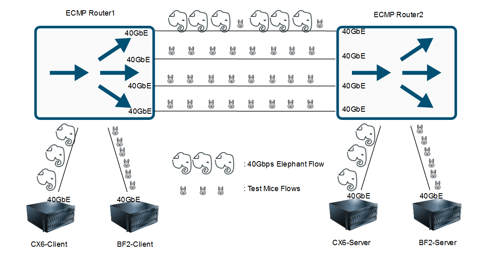
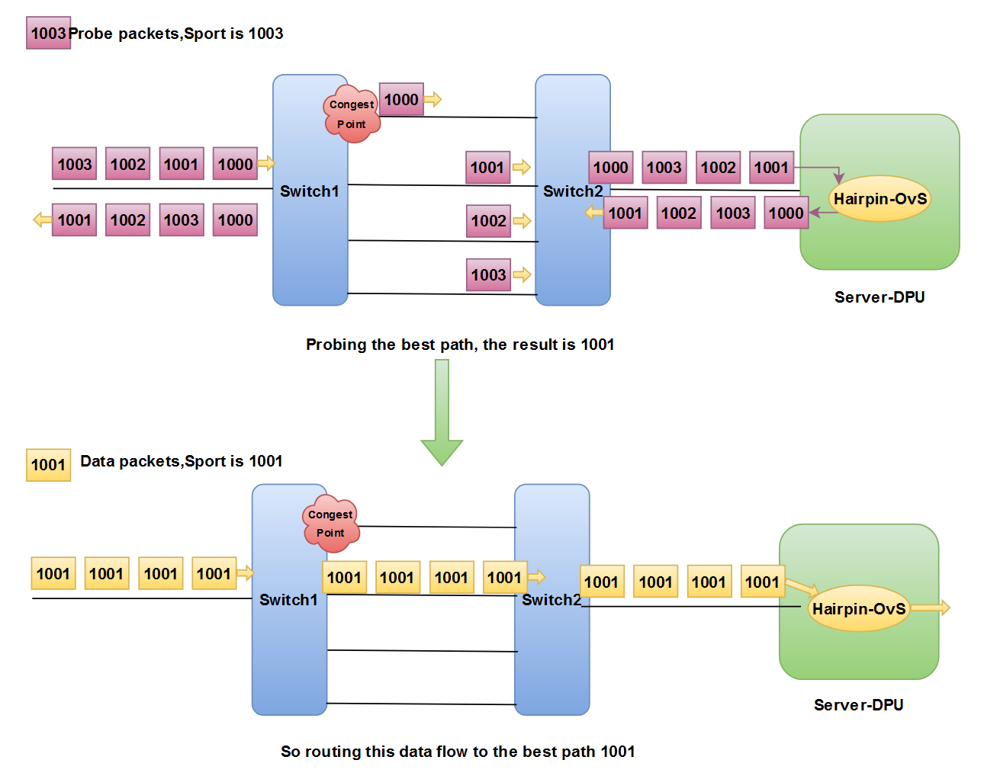

# DOCA-AR

#### Introduction[[中文](./README.md)|[English](./README.en.md)]
* **Introdution：Adaptive Routing Based on DOCA**
    1. Utilize NVIDIA BlueField-2 DPU to offload adaptive routing algorithms based on active detection, and achieve per-flow load balancing of overlay traffic such as VXLAN;
    2. DOCA-AR achieves load balancing based on global congestion perception, by sending probe packets on DPU to obtain congestion status and help traffic avoid congestion points, thereby improving tail latency;
    3. DOCA-AR is deployed on DPU, which has the advantages of host-based scheme being easily aware of global status and switch-based scheme not modifying host protocol stack.

* **Performance：Below are multipath topology we used and test results**

    

    1. The first table tested the maximum completion time (MaxFCT: tail latency) for ten 5MB sized streams;
    2. The second table tested the maximum completion time (MaxFCT: tail latency) for fifty 5MB sized streams;
    3. "With an 40Gbps Elephant Flow" represents the participation of a 40Gbps elephant flow that causes congestion in a path;
    4. It can be seen that compared to ECMP, DOCA-AR can effectively avoid congestion points and improve tail latency. Detailed testing instructions can be found in subsequent content;

<table >
    <thead>
    <tr align="center">
        <th>FlowNum</td>
        <th>MessageSize</td>
        <th colspan=3>Test Times</td>
    </tr>
    </thead>
    <tr align="center">
        <td>10</td>
        <td>5MB</td>
        <td colspan=3>30 times</td>
    </tr>
    <thead>
    <tr align="center">
        <th>Network Load</td>
        <th>Load Balancing Scheme</td>
        <th>MaxFCT-Min[ms]</td>
        <th>MaxFCT-Max[ms]</td>
        <th>MaxFCT-Avg[ms]</td>
    </tr>
    <thead>
    <tr align="center">
        <td rowspan=2>With an 40Gbps Elephant Flow</td>
        <td>DOCA-AR</td>
        <td>22.74</td>
        <td>231.29</td>
        <td>34.21</td>
    </tr>
    <tr align="center">
        <td>ECMP</td>
        <td>27.41</td>
        <td>1709.99</td>
        <td>920.81</td>
    </tr>
    <tr align="center">
        <td rowspan=2>No Elephant Flow</td>
        <td>DOCA-AR</td>
        <td>23.54</td>
        <td>34.49</td>
        <td>27.32</td>
    </tr>
    <tr align="center">
        <td>ECMP</td>
        <td>20.42</td>
        <td>35.1</td>
        <td>26.97</td>
    </tr>
</table>

<table >
    <thead>
    <tr align="center">
        <th>FlowNum</td>
        <th>MessageSize</td>
        <th colspan=3>Test Times</td>
    </tr>
    </thead>
    <tr align="center">
        <td>50</td>
        <td>5MB</td>
        <td colspan=3>30 times</td>
    </tr>
    <thead>
    <tr align="center">
        <th>Network Load</td>
        <th>Load Balancing Scheme</td>
        <th>MaxFCT-Min[ms]</td>
        <th>MaxFCT-Max[ms]</td>
        <th>MaxFCT-Avg[ms]</td>
    </tr>
    <thead>
    <tr align="center">
        <td rowspan=2>With an 40Gbps Elephant Flow</td>
        <td>DOCA-AR</td>
        <td>103.45</td>
        <td>1535.76</td>
        <td>334.52</td>
    </tr>
    <tr align="center">
        <td>ECMP</td>
        <td>1127.96</td>
        <td>2235.71</td>
        <td>1857.05</td>
    </tr>
    <tr align="center">
        <td rowspan=2>No Elephant Flow</td>
        <td>DOCA-AR</td>
        <td>98.35</td>
        <td>292.31</td>
        <td>221.72</td>
    </tr>
    <tr align="center">
        <td>ECMP</td>
        <td>100.83</td>
        <td>289.77</td>
        <td>236.18</td>
    </tr>
</table>

* **Backgroud**：
    * With the booming development of cloud computing and AI technologies, the east-west traffic in data centers is gradually increasing, and the bandwidth has jumped to 100Gbps or even 400Gbps;
    * Data center networks are typically multi-path architectures such as Spine Leaf, which contain redundant links. Traffic between servers is usually routed to different paths to achieve network load balancing, thereby improving link utilization, throughput, and transmission completion time (FCT) of traffic;
    * In the concurrent scenario of data centers, people usually pay more attention to long tail latency (similar to the barrel effect, the worst-case scenario determines overall performance), and the more balanced the network load, the smaller the tail latency usually will be;
    * DCN (Data Center Network) load balancing has always been a hot topic, and related articles appear almost every year at the Computer Network conferences. We have classified them into different types:
        * Classification based on whether congestion status is perceived:
            * Perceive congestion, such as CONGA, can avoid congestion points but has high overhead;
            * Not perceiving congestion, such as ECMP, has low overhead but cannot avoid congestion points;
        * Classified by scheduling granularity:
            * Per-flow, such as ECMP, PLB, with minimal overhead but high granularity;
            * Per-flowlet, such as CONGA;
            * Per-packet, such as the Adaptive Routing (For RDMA) built-in in NVIDIA Spectrum, which results in high overhead but fine granularity due to out of order;
        * Classified by implementation location:
            * Based on switches, such as NVIDIA Spectrum's built-in Adaptive Routing, it is not easy to perceive global congestion status, and implementation is more difficult than end-to-end, but does not require host modification of the protocol stack;
            * Based on Host, such as CLOVE, it is easy to perceive global congestion status but usually requires modifying the host protocol stack;
            * Based on controllers, such as Fastpass;
    * The commonly used network layer load balancing mechanism in data centers currently is ECMP, which adopts per-flow, stateless scheduling approach and does not perceive local congestion status or global congestion status;

* **Application Contribution:**
    * **Explored the feasibility and effectiveness of a new load balancing scheme based on DPU, and provided effective source code and test data as support；**
    * **Compared to ECMP, it greatly improves the problem of long tail latency, simplifies deployment, eliminates the need to modify protocol stacks, and saves host CPU overhead caused by scheduling.**

#### APP Structrue
* APP Structrue
    * Upstream Processing Logic：
        1. Forward the traffic existing in the vxlan pipe to the network;
        2. Forward new traffic to the control plane and revoke the AR algorithm;
        3. Generate doca-flow entry for new traffic and add them into FDB;
        4. Handle aging connections;

    

    * Upstream Processing Logic：
        1. Forwarding and returning probe packets into the control plane;
        2. Forward the remaining traffic to the host;
    
    

* AR Algorithm:
    1. The control plane receives new traffic and extract corresponding 5-tuple information;
    2. Send 4 probe packets per-flow, with the header consistent with the new traffic. Except for the source port number increasing packet by packet, the source port number of the first probe packet is consistent with the new traffic;
    3. The peer DPU sends probe packets back through the Hairpin queue;
    4. Receive returned probe packets to obtain the current best path, and route new traffic to this path;
    5. The main idea is Min-RTT, and congestion can lead to an increase in path latency. We choose the path with the lowest latency to avoid congestion.

    

#### Using Tutorials 
0.  Compile 
    * Environment
        * Client: DPU with DOCA 1.5
        * Server: DPU with any version DOCA (CX6 May work)
    * Compile in Client DPU：
        > #Download src code onto Client DPU Arm  
        > meson build  
        > ninja -C build  

1.  Receiver Config：
    * In Arm, add flows to the DPU-OvS flow table, classify the probe packets, and use hairpin to offload the returning action. We conducted the experiment in the L2 environment, so we did not exchange IPs and only modified the destination mac address;
        > ovs-ofctl del-flows ovsbr1  
        > ovs-ofctl add-flow ovsbr1 "priority=300,in_port=p0,udp,tp_dst=4789,nw_tos=0x20 actions=mod_dl_dst:08:c0:eb:bf:ef:9a,mod_tp_dst:4788,output:IN_PORT"  
        > ovs-ofctl add-flow ovsbr1 "priority=100,in_port=p0 actions=output:pf0hpf"  
        > ovs-ofctl add-flow ovsbr1 "priority=100,in_port=pf0hpf actions=output:p0"  
    * In host, build VTEP;
        > ip link add vxlan0 type vxlan id 42 dstport 4789 remote 192.168.200.2 local 192.168.200.1 dev enp1s0f0np0  
        > ifconfig vxlan0 192.168.233.1

2.  Sender Config
    * In Arm, run the following two scripts to establish two SF, modify the OvS topology, and add flows to the OvS flow table;
        > bash scripts/2SF-ON-P0-Build.sh  
        > bash scripts/2SF-ON-P0-INIT.sh
    * In host, build VTEP;
        > ip link add vxlan0 type vxlan id 42 dstport 4789 remote 192.168.200.1 local 192.168.200.2 dev enp1s0f0np0  
        > ifconfig vxlan0 192.168.233.2

3.  Running App
    * Running DOCA-AR：`bash doca_ar.sh`
    * Running ECMP as comparison： `bash ecmp.sh`
    * After entering into cmdline, input `quit` to exit, input `conntrack` print active connections；

#### Test instructions
* Device Model
    * DPU： NVIDIA BF2 100GbE 
    * CX6： NVIDIA CX6 100GbE 
    * Router: Intel Barefoot P4 Switch 100GbE
* Test Software
    * In BF2 devices，use iPerf send TCP traffic on Overlay Network；
    * In CX6 devices，a stateless UDP flow generated using DPDK-Pktgen, with a packet size of MTU and no congestion control

#### Limitations
* VTEP was placed on the Host and not offloaded to Arm;
* Only track the connection based on the tunnel head, without identifying the head inside the tunnel. When there are few connections, a basic Overlay connection corresponds to a different tunnel 5-tuple;
* Blocking probe, which does not send new connections before the probe function expires or arm receives the returned probe packets, can easily lead to a decrease in CPS;
* The AR algorithm is too rough and simple.

#### Demonstration and Docs
* The demonstration video has been uploaded to Baidu Netdisk. [Click on me to view the experimental process](https://pan.baidu.com/s/1NnJ9KSgeFwUsq3ykk-ufjw?pwd=adv8)；
* [Click on me to view API documentation](https://markchen7788.github.io/doca_ar/html/)