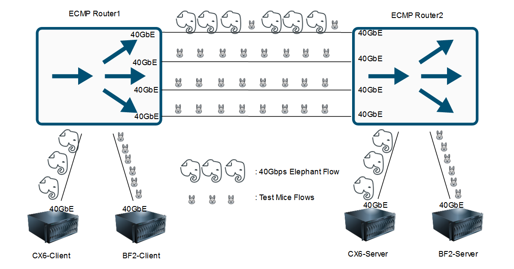
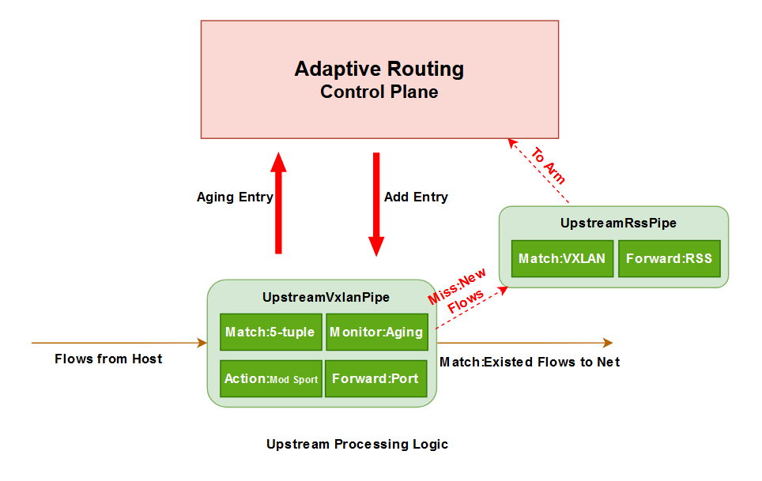
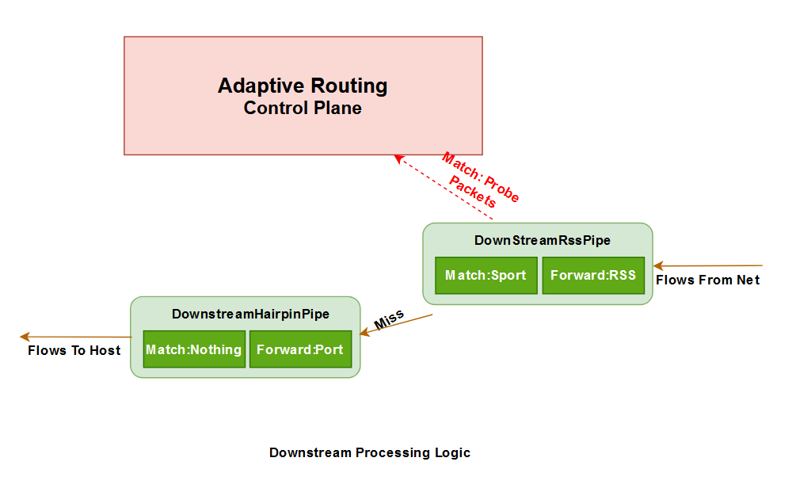
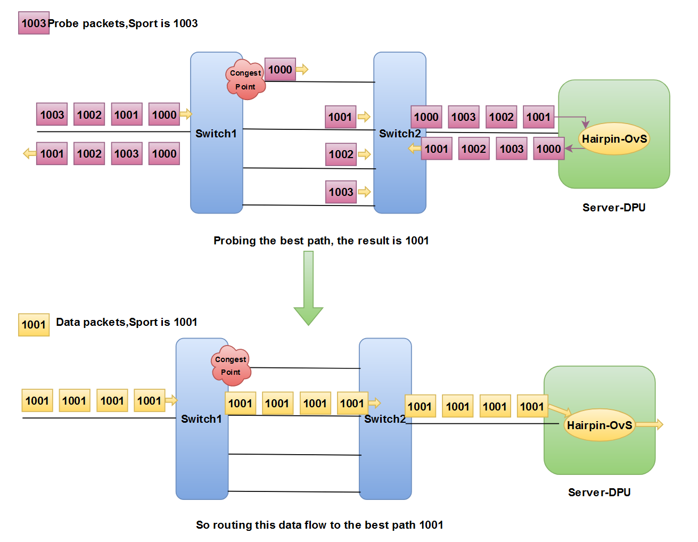

# DOCA-AR

#### 介绍
* **应用简介：基于DOCA的自适应路由**
    1. 利用NVIDIA BlueField-2 DPU卸载基于主动探测的自适应路由算法，实现VXLAN等Overlay流量的逐流负载均衡;
    2. DOCA-AR实现了基于全局拥塞感知的负载均衡，通过在端侧发送探测报文获取拥塞状态并帮助流量避开拥塞点从而改善尾时延；
    3. DOCA-AR部署在DPU，既拥有主机方案易感知全局状态的特点，也拥有交换机方案不修改主机协议栈的优势。
* **性能表现：如下是我们测试的多路径环境拓扑图和尾时延测试结果**

    

    1. 第一张表，测试了10条5MB大小的流的最大完成时间（MaxFCT:尾时延）；
    2. 第二张表，测试了50条5MB大小的流的最大完成时间（MaxFCT:尾时延）；
    3. “With an 40Gbps Elephant Flow”代表引入一条40Gbps的大象流致使一条路径产生拥塞；
    4. 可以看出相对于ECMP，DOCA-AR能够很好的避开拥塞点，改善尾时延，详细测试说明可参看后续内容；

<table >
    <thead>
    <tr align="center">
        <th>FlowNum</td>
        <th>MessageSize</td>
        <th colspan=3>Test Times</td>
    </tr>
    </thead>
    <tr align="center">
        <td>10</td>
        <td>5MB</td>
        <td colspan=3>30 times</td>
    </tr>
    <thead>
    <tr align="center">
        <th>Network Load</td>
        <th>Load Balancing Scheme</td>
        <th>MaxFCT-Min[ms]</td>
        <th>MaxFCT-Max[ms]</td>
        <th>MaxFCT-Avg[ms]</td>
    </tr>
    <thead>
    <tr align="center">
        <td rowspan=2>With an 40Gbps Elephant Flow</td>
        <td>DOCA-AR</td>
        <td>22.74</td>
        <td>231.29</td>
        <td>34.21</td>
    </tr>
    <tr align="center">
        <td>ECMP</td>
        <td>27.41</td>
        <td>1709.99</td>
        <td>920.81</td>
    </tr>
    <tr align="center">
        <td rowspan=2>No Elephant Flow</td>
        <td>DOCA-AR</td>
        <td>23.54</td>
        <td>34.49</td>
        <td>27.32</td>
    </tr>
    <tr align="center">
        <td>ECMP</td>
        <td>20.42</td>
        <td>35.1</td>
        <td>26.97</td>
    </tr>
</table>

<table >
    <thead>
    <tr align="center">
        <th>FlowNum</td>
        <th>MessageSize</td>
        <th colspan=3>Test Times</td>
    </tr>
    </thead>
    <tr align="center">
        <td>50</td>
        <td>5MB</td>
        <td colspan=3>30 times</td>
    </tr>
    <thead>
    <tr align="center">
        <th>Network Load</td>
        <th>Load Balancing Scheme</td>
        <th>MaxFCT-Min[ms]</td>
        <th>MaxFCT-Max[ms]</td>
        <th>MaxFCT-Avg[ms]</td>
    </tr>
    <thead>
    <tr align="center">
        <td rowspan=2>With an 40Gbps Elephant Flow</td>
        <td>DOCA-AR</td>
        <td>103.45</td>
        <td>1535.76</td>
        <td>334.52</td>
    </tr>
    <tr align="center">
        <td>ECMP</td>
        <td>1127.96</td>
        <td>2235.71</td>
        <td>1857.05</td>
    </tr>
    <tr align="center">
        <td rowspan=2>No Elephant Flow</td>
        <td>DOCA-AR</td>
        <td>98.35</td>
        <td>292.31</td>
        <td>221.72</td>
    </tr>
    <tr align="center">
        <td>ECMP</td>
        <td>100.83</td>
        <td>289.77</td>
        <td>236.18</td>
    </tr>
</table>

* **使用背景**：
    * 云计算和AI等技术的蓬勃发展，数据中心东西向流量逐渐增多，带宽跃升至100Gbps甚至400Gbps；
    * 数据中心网络通常是Spine-Leaf等包含冗余链路的多路径架构，服务器之间的流量通常会被路由到不同路径来实现网络负载均衡，从而提高链路利用率、提升吞吐并改善流量的传输完成时间(FCT)；
    * 数据中心的并发场景下，通常大家会更关注长尾时延（类似木桶效应，最坏的情况决定整体表现），网络负载越均衡尾时延通常也会越小；
    * DCN(数据中心网络)负载均衡一直是热议话题，几乎每年的网络顶会都会出现相关文章，我们将它们划分成了不同类型：
        * 按照是否感知拥塞状态分类：
            * 感知拥塞，例如CONGA，能避开拥塞点但开销大；
            * 不感知拥塞，例如ECMP，开销小但不能避开拥塞点；
        * 按照调度粒度分类：
            * 逐流，例如ECMP，PLB，开销最小但是粒度大；
            * 逐flowlet，例如CONGA；
            * 逐包，例如NVIDIA Spectrum自带的Adaptive Routing(For RDMA)，乱序导致开销大但是粒度细；
        * 按照实现位置分类：
            * 基于交换机，例如NVIDIA Spectrum自带的Adaptive Routing，不易感知全局拥塞状态、实现比端侧难但不需要端侧修改协议栈；
            * 基于Host，例如CLOVE，容易感知全局拥塞状态但通常需要修改主机协议栈；
            * 基于控制器，例如Fastpass；
    * 目前数据中心比较常用的网络层负载均衡机制是ECMP，它采用逐流、无状态的调度，不感知本地的拥塞状态也不感知全局的拥塞状态；
* **应用价值**：
    * **探索了基于DPU的新型负载均衡方案的可行性和有效性，并提供了有效的源代码和测试数据作为支持；**
    * **相对于ECMP，极大得改善了长尾时延问题，部署实现简单、不需要修改协议栈且节省调度带来的主机CPU开销。**

#### 软件架构
* APP架构
    * 上行流量处理：
        1. 转发vxlan-pipe中存在的流量至网络；
        2. 转发新流量至控制平面并调用AR算法；
        3. 为新流量生成Pipe表项并下发；
        4. 处理老化连接；

    

    * 下行流量处理：
        1. 转发回传探测包进入控制平面；
        2. 转发其余流量至主机；
    
    

* AR算法:
    1. 控制平面接收到新流量，并提取对应的5元组信息；
    2. 发送4个探测报文，包头和新流量一致，除了源端口号逐包递增，第一个探测包的源端口号与新流量一致；
    3. 对端DPU通过Hairpin队列将探测包传回；
    4. 接收回传探测包获取当前最佳路径，将新流量路由到这条路径上；
    5. 主体思想就是Min-RTT，拥塞会导致路径时延增加，我们选取时延最低路径来避开拥塞。

    

#### 使用教程
0.  程序编译 
    * 环境要求
        * Client: DPU with DOCA 1.5
        * Server: DPU with any version DOCA (CX6应该也可以，做好探测包回传即可)
    * Client DPU编译动作：
        > #下载此仓库源码到Client DPU Arm中  
        > meson build  
        > ninja -C build  

1.  接收端配置：
    * 在Arm中，下发DPU-OvS 流表，分离探测包并用hairpin卸载回传动作, 我们是在二层环境做的实验，所以不交换IP,修改目的地址即可；
        > ovs-ofctl del-flows ovsbr1  
        > ovs-ofctl add-flow ovsbr1 "priority=300,in_port=p0,udp,tp_dst=4789,nw_tos=0x20 actions=mod_dl_dst:08:c0:eb:bf:ef:9a,mod_tp_dst:4788,output:IN_PORT"  
        > ovs-ofctl add-flow ovsbr1 "priority=100,in_port=p0 actions=output:pf0hpf"  
        > ovs-ofctl add-flow ovsbr1 "priority=100,in_port=pf0hpf actions=output:p0"  
    * 在Host中，创建VTEP;
        > ip link add vxlan0 type vxlan id 42 dstport 4789 remote 192.168.200.2 local 192.168.200.1 dev enp1s0f0np0  
        > ifconfig vxlan0 192.168.233.1

2.  发送端配置
    * 在Arm中，运行如下两个脚本，建立两个SF、修改OvS拓扑并下发OvS流表;
        > bash scripts/2SF-ON-P0-Build.sh  
        > bash scripts/2SF-ON-P0-INIT.sh
    * 在Host中，ecmpecmp
        > ip link add vxlan0 type vxlan id 42 dstport 4789 remote 192.168.200.1 local 192.168.200.2 dev enp1s0f0np0  
        > ifconfig vxlan0 192.168.233.2

3.  运行程序
    * 运行DOCA-AR：`bash doca_ar.sh`
    * 运行ECMP最对比： `bash ecmp.sh`
    * 进入程序控制台后，输入`quit`退出，输入`conntrack`打印当前活跃连接；

#### 测试说明

* 测试物理拓扑：和上述多路径环境一致；
* 设备型号：
    * DPU： NVIDIA BF2 100GbE 
    * CX6： NVIDIA CX6 100GbE 
    * Router: Intel Barefoot P4 Switch 100GbE
* 测试软件：
    * 在BF2设备上，使用的是iPerf发送的TCP流量，并运行在Overlay网络上；
    * 在CX6设备上，使用的是DPDK-Pktgen产生的一条无状态UDP流，包大小为MTU，无拥塞控制；

#### 仍存在的问题
* VTEP放在了Host上，没有卸载VTEP至Arm；
* 只根据隧道头部做连接跟踪，不识别隧道内头部，连接较少时，基本一条Overlay连接对应一个不同的隧道五元组；
* 阻塞式的探测，在探测函数未超时时不发送新连接，容易导致CPS下降。

#### 演示及文档
* 演示视频已上传至百度网盘，点我可前往查看实验过程；
* [点我可查看API文档](https://markchen7788.github.io/doca_ar/html/)